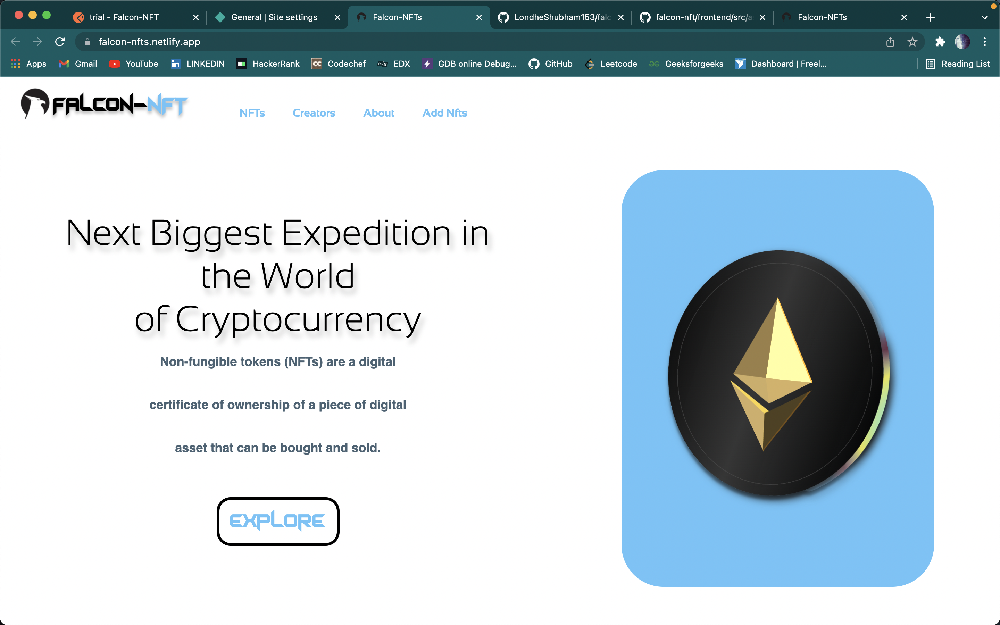
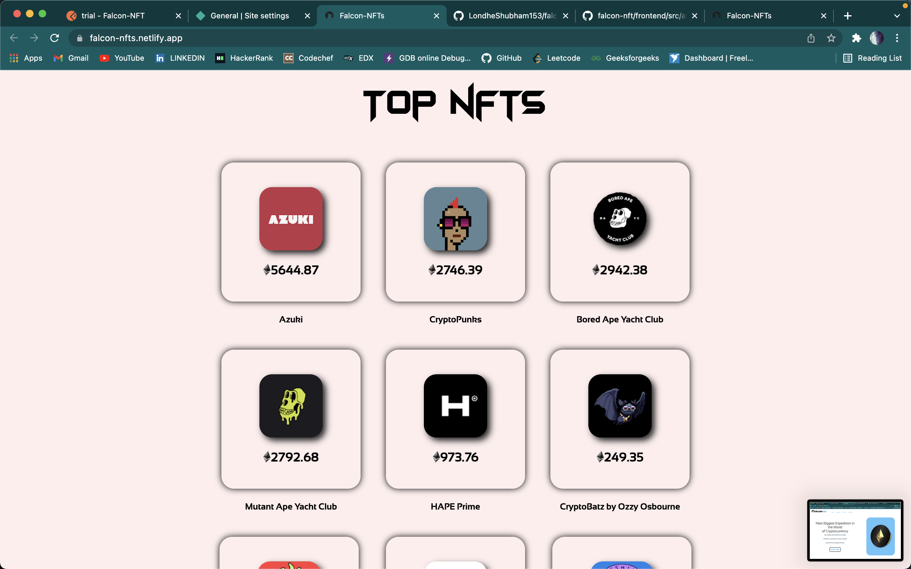

<!-- PROJECT LOGO -->
 

  

  <h3 align="center">Falcon-NFTs</h3>

  

    This site has listed the top 15 Nfts all over the world!

  

    <a href="https://falcon-nfts.netlify.app/">View Demo</a>
    ·
    <a href="https://github.com/LondheShubham153/">Report Bug</a>
    ·
    <a href="https://github.com/LondheShubham153/">Request Feature</a>
  

<!-- TABLE OF CONTENTS -->
## Table of Contents

* [About the Project](#about-the-project)
  * [Built With](#built-with)
* [Getting Started](#getting-started)
  * [Prerequisites](#prerequisites)
  * [Installation](#installation)

* [Contributors](#contributors)
* [Contributing](#contributing)

<!-- ABOUT THE PROJECT -->
## About The Project

Next Biggest Expedition in the World of Cryptocurrency ..!
Non-fungible tokens (NFTs) are a digital certificate of ownership of a piece of digital asset that can be bought and sold.

A list of commonly used resources that I find helpful are listed in the acknowledgements.

## Contributors

<!-- CONTRIBUTING -->
## Contributing

Contributions are what make the open source community such an amazing place to be learn, inspire, and create. Any contributions you make are **greatly appreciated**.

1. Fork the Project
2. Create your Feature Branch (`git checkout -b feature/AmazingFeature`)
3. Commit your Changes (`git commit -m 'Add some AmazingFeature'`)
4. Push to the Branch (`git push origin feature/AmazingFeature`)
5. Open a Pull Request

